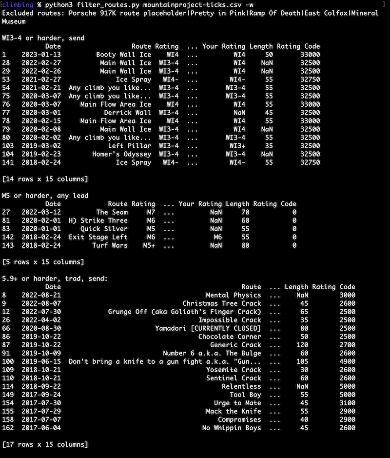

## Filter a Mountain Project tick list
Import and filter a [Mountain Project](https://www.mountainproject.com) tick list (ticks.csv) using the pandas library.

Print condensed output:
```python3 filter_routes.py mountainproject-ticks.csv```

Write full output to csv files:
```python3 filter_routes.py mountainproject-ticks.csv -w```

Add routes to exclude to exclude_routes.txt


